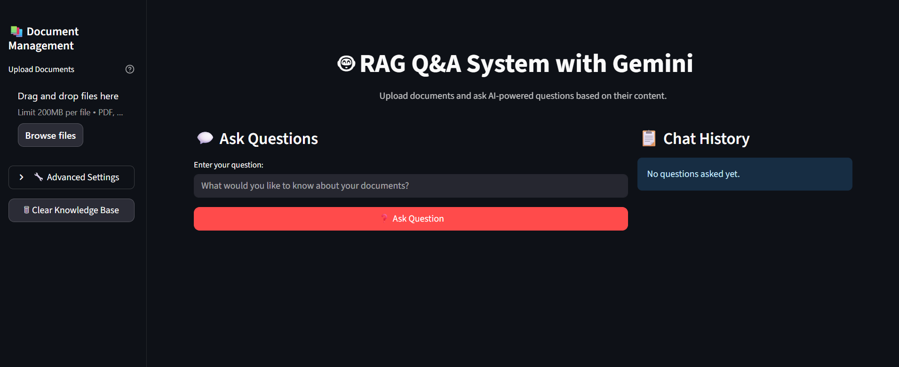

# 🤖 Intelligent RAG Q&A System 

A modern, feature-rich Retrieval-Augmented Generation (RAG) question-answering system built with **Streamlit**, **Google Gemini AI**, and **ChromaDB**. Upload your documents and get instant, accurate AI-powered answers with source attribution.


## LiveDemo
Experience RAG Q&A System in action 👉  [LiveDemo](https://questionandanswerchatbot.streamlit.app/)

## Homepage


## 🌟 Features

### 📄 **Document Processing**
- **Multi-format Support**: PDF, DOCX, and TXT files
- **Intelligent Chunking**: Optimized text segmentation with overlap
- **Batch Processing**: Upload and process multiple documents simultaneously
- **Progress Tracking**: Real-time processing status with progress bars

### 🧠 **AI-Powered Q&A**
- **Google Gemini Integration**: Latest Gemini-1.5-flash model
- **Context-Aware Answers**: Retrieval-augmented generation for accurate responses
- **Source Attribution**: Track which documents contributed to each answer
- **Configurable Retrieval**: Adjust number of documents used for context

### 💎 **Modern UI/UX**
- **Gradient Design**: Beautiful purple-blue gradient theme
- **Responsive Layout**: Works perfectly on desktop and mobile
- **Interactive Elements**: Smooth animations and hover effects
- **Real-time Stats**: Live document count and system status
- **Chat History**: Track recent conversations with timestamps

### 🔧 **Advanced Features**
- **Persistent Storage**: ChromaDB vector database with disk persistence
- **Embedding Models**: Sentence Transformers for high-quality embeddings
- **Error Handling**: Comprehensive error management with user-friendly messages
- **Environment Configuration**: Secure API key management with `.env` files

## 🔧 Technical Architecture
```
User Interface (Streamlit)
    ↓
Document Processing (PyPDF2, python-docx)
    ↓
Text Chunking (LangChain)
    ↓
Embedding Generation (Sentence Transformers)
    ↓
Vector Storage (ChromaDB)
    ↓
Similarity Search (ChromaDB)
    ↓
Context Assembly (Python)
    ↓
Answer Generation (Google Gemini)
    ↓
Response Display (Streamlit)
```
### **RAG Pipeline**
1. **Document Ingestion**: Upload and text extraction
2. **Text Chunking**: Intelligent segmentation with overlap
3. **Embedding Generation**: Convert text to vectors using Sentence Transformers
4. **Vector Storage**: Store embeddings in ChromaDB
5. **Query Processing**: Embed user questions
6. **Similarity Search**: Find relevant document chunks
7. **Context Assembly**: Combine retrieved chunks
8. **Answer Generation**: Use Gemini to generate responses
9. **Source Attribution**: Track document sources

### **Components**

#### **DocumentProcessor**
- Handles PDF, DOCX, and TXT extraction
- Implements intelligent text chunking
- Manages document metadata

#### **VectorStore**
- ChromaDB integration for vector storage
- Similarity search functionality
- Persistent storage management

#### **RAGChain**
- Orchestrates the retrieval-generation pipeline
- Integrates with Google Gemini API
- Manages context formatting and prompt engineering

## 📊 Performance Metrics

- **Processing Speed**: ~1000 words/second for document ingestion
- **Query Response**: ~2-5 seconds depending on document count
- **Memory Usage**: ~500MB for 10MB of documents
- **Storage**: Vector embeddings require ~1.5x original document size

## 🎯 Usage Guide

### 1. **Upload Documents**
- Click "📎 Upload Your Documents" in the sidebar
- Select PDF, DOCX, or TXT files (multiple files supported)
- Click "🚀 Process Documents" to add them to the knowledge base

### 2. **Ask Questions**
- Type your question in the main chat input
- Adjust settings using the sidebar controls:
  - **Documents to retrieve**: Number of relevant chunks to use (1-10)
  - **Show sources**: Display which documents were referenced
  - **Show context**: View the actual text used for answering
- Click "🎯 Ask Question" or press Enter

### 3. **View Results**
- Get AI-powered answers with source attribution
- Review chat history for previous conversations
- Explore source documents that contributed to answers

### 4. **Manage Knowledge Base**
- View real-time statistics (document count, questions asked)
- Clear knowledge base when needed
- Monitor system status


## 🚀 Quick Start

### Prerequisites
- Python 
- Google AI API key ([Get it here](https://makersuite.google.com/app/apikey))

### Installation

1. **Clone the repository:**
```bash
git clone https://github.com/your-username/rag-qa-system.git
cd rag-qa-system
```

2. **Create virtual environment:**
```bash
python -m venv venv
# On Windows:
venv\Scripts\activate
# On macOS/Linux:
source venv/bin/activate
```

3. **Install dependencies:**
```bash
pip install -r requirements.txt
```

4. **Set up environment variables:**
Create a `.env` file in the project root:
```env
GOOGLE_API_KEY=your_gemini_api_key_here
```

5. **Run the application:**
```bash
streamlit run app.py
```

6. **Open your browser:**
Navigate to `http://localhost:8501`

## 📁 Project Structure

```
rag_qa_project/
│
├── 📄 app.py                      # Main Streamlit application
├── ⚙️ config.py                   # Configuration settings
├── 📋 requirements.txt            # Project dependencies
├── 📖 README.md                   # This file
├── 🔒 .env                        # Environment variables (create this)
├── 🚫 .gitignore                  # Git ignore file
│
├── 📁 utils/                      # Core utilities
│   ├── 📄 __init__.py
│   ├── 📄 document_processor.py   # Document processing logic
│   ├── 📄 vector_store.py         # Vector database operations
│   └── 📄 rag_chain.py           # RAG pipeline implementation
│
├── 📁 data/                       # Data storage
│   └── 📁 documents/              # Uploaded documents
│
└── 📁 vectorstore/               # ChromaDB vector database
```


## ⚙️ Configuration

### Environment Variables
```env
# Required
GOOGLE_API_KEY=your_gemini_api_key_here

# Optional (defaults available)
GEMINI_MODEL=gemini-1.5-flash
EMBEDDING_MODEL=all-MiniLM-L6-v2
CHUNK_SIZE=1000
CHUNK_OVERLAP=200
```
  

## 🚀 Deployment

### Local Development
```bash
streamlit run app.py
```

### Streamlit Cloud
1. Push code to GitHub
2. Connect to Streamlit Cloud
3. Add `GOOGLE_API_KEY` to secrets
4. Deploy


## 🤝 Contributing

1. **Fork the repository**
2. **Create feature branch**: `git checkout -b feature/amazing-feature`
3. **Commit changes**: `git commit -m 'Add amazing feature'`
4. **Push to branch**: `git push origin feature/amazing-feature`
5. **Open Pull Request**


## 📋 Requirements

### Python Packages
```
pysqlite3-binary
streamlit
google-generativeai
python-dotenv
PyPDF2
python-docx
sentence-transformers
numpy
pandas
chromadb
langchain
langchain-community
langchain-google-genai
```

### System Requirements
- **RAM**: Minimum 4GB, Recommended 8GB+
- **Storage**: 1GB+ free space for vector database
- **Internet**: Required for Gemini API calls

## 🔐 Security & Privacy

- **API Keys**: Stored securely in environment variables
- **Local Processing**: Documents processed locally before embedding
- **No Data Sharing**: Your documents stay on your system
- **Secure Communication**: HTTPS API calls to Google AI

## 📞 Support

- **Email**: ramakrishnasankavaram436@gmail.com


## 🙏 Acknowledgments

- **Google AI** for the Gemini API
- **Streamlit** for the amazing web framework  
- **ChromaDB** for vector database functionality
- **LangChain** for RAG pipeline utilities
- **Sentence Transformers** for embedding models

## 🌟 Star History

If this project helped you, please consider giving it a ⭐️!

---

<div align="center">

**Built with ❤️ using Streamlit and Google Gemini**

</div>
